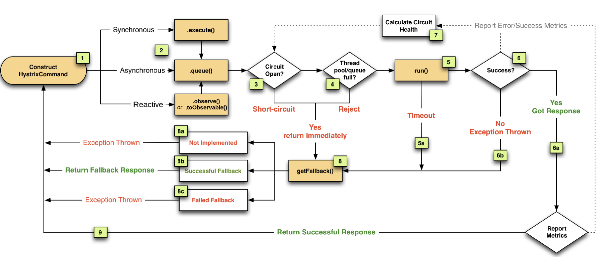
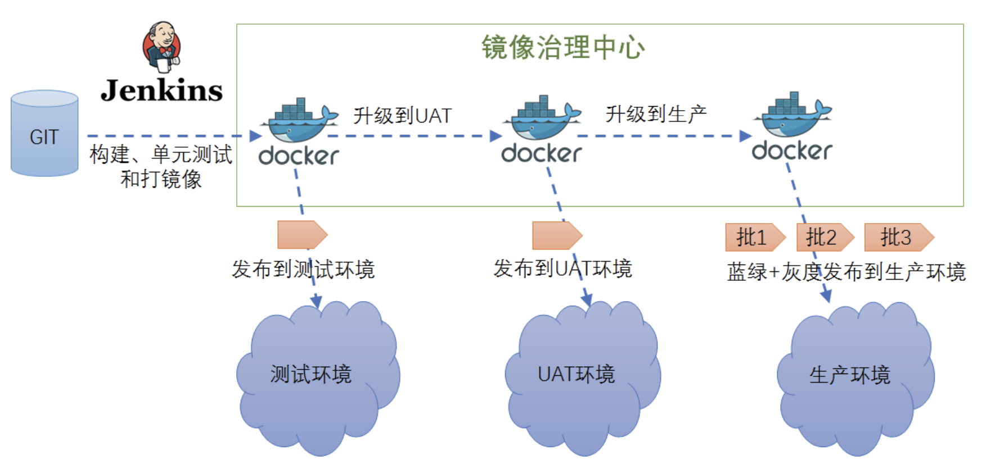
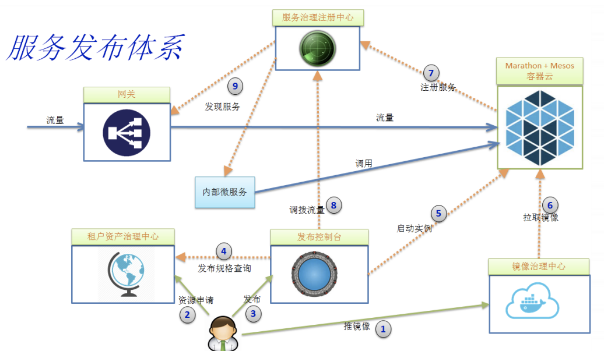

## Micro Services 微服务架构

### 8. 三种服务发现机制

- 传统基于LB模式    当服务提供方上线会向运维申请域名,然后把域名配置到负载均衡,把域名指向后台服务,服务
多份然后请求来通过DNS解析,解析后到LB上,根据域名负载均衡到后台服务上
- 进程内LB模式    服务提供方通过服务注册方式(服务注册表),并且定期发送心跳,告诉服务注册表我还活着
- 主机独立LB模式  在前面2个基础做个折中，把LB以独立进程部署,但是在一个主机上其他和第2个一样支持多语言,
不同语言都可以介入运维部署比较麻烦,因为每个主机都要部署

### 9. API网关

基本功能

- 反向路由,将外部请求转化为内部服务调用
- 请求校验,身份识别,安全措施
- 限流熔断,防止大流量
- 日志监控

### 10. 开源网关Zuul架构

### 11. Netflix微服务路由发现体系

服务注册中心 Eureka

### 12. 集中式配置中心的作用和原理

携程Apollo项目

### 13. Rpc 对比 REST(http)

|  | Rpc | REST |
|---|---|---|
|耦合性| 强耦合 | 松散耦合 |
|消息协议| 二进制 thrift、protobuf、avro | xml、json |
|通信协议| TCP | HTTP/HTTP2 |
|性能| 高 | 一般低于rpc |
|接口契约| Thrift, protobuf IDL文件 | Swagger |
|客户端| 强类型客户端，一般自动生成，支撑多语言 | 一般http client可以访问，也可以自动生成客户端，支撑多语言 |
|案例| dubbo、motan、Tars(腾讯)、grpc、thrift | springmvc/boot、Jax-rs、dropwizard |
|开发者友好| 客户端使用方便，但二进制不可读 | 文本可读，浏览器可以访问 |
|对外开放| 对外一般转换称 REST/文本协议 | 直接可以对外开放 |

### 14. 微服务框架管理和治理

- 日志监控能力
- metrics出错监控
- 调用监控,有错综复杂的依赖管理,没有调用链,我们会迷失在里面
- 限流熔断,分布式系统,某个服务故障有可能给整个系统瘫痪
- 安全访问控制：有些敏感信息,不希望别人看到,可以加黑名单,拦截
- 调用策略rpc/rest
- 序列化能同时支持二进制也能支持xml/json,能灵活配置
- 代码生成,契约驱动,根据契约生成一些规范代码,比如生成客户端,服务端
- 定义异常,大家的处理标准化,我们容易定位.不这样,大家各自玩法不一样,我们难以定位
- 文档好,开发接入成本低
- 集中的配置系统,能灵活配置系统
- 后台很多服务DB/MQ/Cache等,框架要能集成这些服务的能力
- 需要集成服务注册发现机制,服务消费者怎么发现服务的生产者
- 大规模部署,服务就需要负载均衡,不同版本发布,需要软路由能力

### 15. 微服务监控系统分层和监控架构

- 端用户体验监控（性能、返回码、城市、地区、运营商、版本、系统等）
- 业务监控（核心指标监控、登录注册、下单、支付等）
- 应用层监控（url、service、sql、cache可用率、响应时间、qps等）
- 系统层监控（物理机、虚拟机、os、cpu、memory、network、disk等）
- 基础设施层监控（网络、交换机、网络流量、丢包、错包、连接数等）

具体监控策略：

- 日志监控
- Metric监控
- 调用链监控
- 告警系统
- 健康检查

主流监控架构:

微服务和机器（agent搜集metric和log） --> kafka等 --> elk(处理log)/InfluxDB、Grafana 和 Nagios（处理metrics）

### 16. 调用链监控原理和选型

调用链监控原理：

- CAT 点评的
- zipkin 推特的
- pinpoint 韩国的

调用链监控选型：

|  | CAT | Zipkin | pinpoint |
|---|---|---|---|
| 调用链可视化 | 有 | 有 | 有 |
| 报表 | 非常丰富 | 少 | 中 |
| ServerMap | 简单依赖图 | 简单 | 好 |
| 埋点方式 | 侵入 | 侵入 | 不侵入字节码增强 |
| Heartbeat支持 | 有 | 无 | 有 |
| Metric支持 | 有 | 无 | 无 |
| Java/.net客户端支持 | 好 | 无 | Java支持 |
| Dashboard中文支持 | 好 | 无 | 无 |
| 社区支持 | 好，文档丰富 | 好，一般暂无中文资料 | 一般文档缺失，无中文社区 |
| 国内案例 | 携程、点评、陆金所 | 京东、阿里扩展不开源 | 暂无 |
| 源头祖先 | eBay CAL（Centralized Application Logging） | Google Dapper | Google Dapper |

### 17. 微服务容错限流（hystrix断路器原理）

- 熔断: 比如用电高,熔断设备保护,电流不至于过大引发火灾
- 隔离: cpu,内存有大小,不隔离,一个使用完,其他人就用不了
- 限流: 当大流量来的时候,要限流,比如一秒100请求,大了不行,这时候要限流
- 降级: 当系统发生故障,我们要降级,不至于故障恶化

### 18. Docker 容器部署技术 & 持续交付流水线

容器交付流水线

### 19. 容器集群调度和基于容器的发布体系

资源调度框架 Apache Mesos（twitter）和 k8s

基于容器云发布体系

> [可参考看云文档](https://www.kancloud.cn/architect-jdxia/architect/519429)