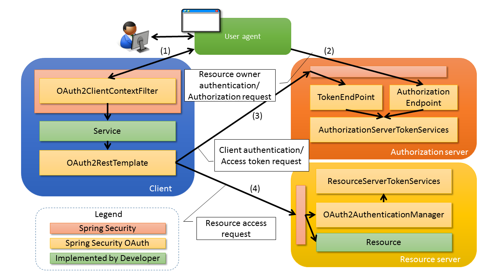

## Micro Services 微服务架构实践

### 2. 微服务安全架构问题域

- 开发系统间认证和授权的问题（社交联合登录、开发平台API）
- 现代微服务安全（单页浏览器APP、无线原声App、服务器端WebApp、微服务和API调用）问题
- 企业内部应用认证授权（IAM/SSO）问题

**OAuth2 的应用场景**

- 用于 REST/APIs 的代理授权框架（delegated authorization framework）
- 基于令牌 Token 的授权，在无需用户密码情况下获取对用户数据的访问权限
- 解耦认证和授权
- 事实上标准安全框架支持多种用例场景（单页浏览器APP、无线原声App、服务器端WebApp、服务器与服务器之间的调用）

**OAuth2 的优势**

- 比 OAuth1 易于实现
- 更安全，客户端不接触用户密码，服务器端更易集中保护
- 广泛传播并被持续采用
- 短寿命和封装的 token
- 资源服务器和授权服务器解耦
- 集中式授权和简化客户端
- HTTP/JSON 友好，易于请求和传递 token
- 考虑多种客户端架构场景
- 客户可以具有不同的信任级别

**OAuth2 的缺点**

- 协议框架太宽泛，造成各种实现兼容性和互操作性差
- 不兼容OAuth1
- 不是一个认证协议，是一个代理授权协议，不会告诉你用户任何信息

### 3. OAuth2.0的角色 和 术语

四大角色：

- 资源拥有者 Owner   （当前用户）
- 客户应用   Client App （无线应用/web）
- 授权服务器 Authorized Server
- 资源服务器 Resources Owner （待访问的资源api）

基本术语：

- 客户凭证 client credentials
- 令牌 tokens
- 作用域 scopes

令牌类型：

- 访问令牌 代表一个用户或服务直接访问受保护的资源
- 刷新令牌 用于去授权服务器获取一个新的访问令牌
- 授权码 仅用于授权码授权类型，用于交换获取访问令牌和刷新令牌
- Bearer Token 不管谁拿到token都可以访问资源
- Proof of Possession (PoP) Token 可以校验client是否对Token有明确的拥有权

误解：

- OAuth并没有支持HTTP以外的协议
- OAuth并不是一个认证协议
- OAuth并没有定义授权处理机制
- OAuth并没有定义token格式
- OAuth2并没有定义加密方法
- OAuth2并不是单个协议
- OAuth2仅是授权框架，用于授权代理
- 应用的具体安全场景需要定制 OAuth2

### 4. 典型的 OAuth2 Flow 和选型

参考资料：[RFC6749](http://www.rfcreader.com/#rfc6749) 和 [阮一峰理解OAuth2.0](http://www.ruanyifeng.com/blog/2014/05/oauth_2_0.html)

- 授权码模式
- 简化模式
- 密码模式
- 客户端模式

- 另附：刷新令牌工作流

### 5. Spring Security OAuth2框架实操

OAuth2.0服务器组成：

- Authorize Endpoint (/oauth2/authorize)
- Token Endpoint (/oauth2/token)
- Introspection Endpoint (/oauth2/introspect)
- Revocation Endpoint (/oauth2/revoke)

Spring Security OAuth2 架构

