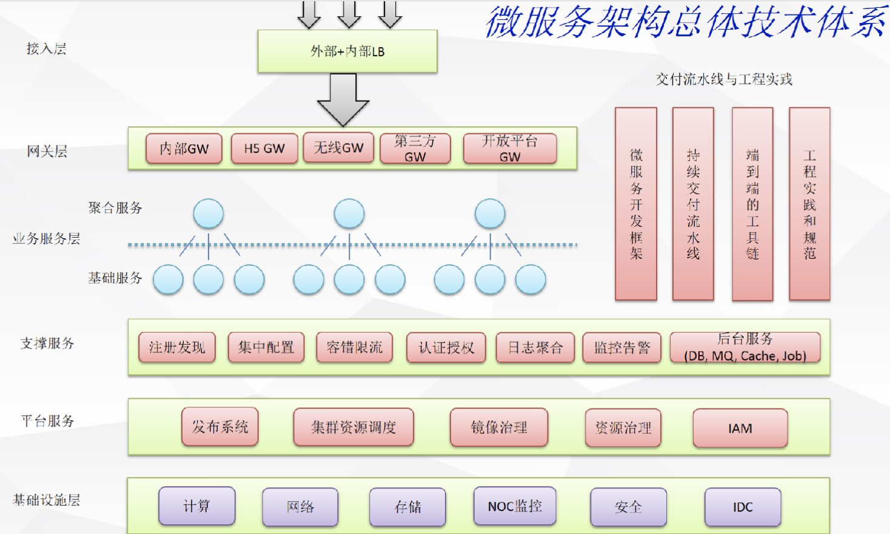

## Micro Services 微服务架构

### 1. 概念定义

Micro Services是一种特殊的松散耦合（loosely coupled）拥有独立的上下文边界（bounded context）的SOA架构风格,包含以下特点：

- 一组小的服务
- 独立的进程
- 轻量级通信
- 基于业务能力
- 可独立部署
- 无集中式管理

### 2. 权衡微服务架构利弊

优势：

- 强模块化边界
- 可独立部署
- 技术多样性

缺点：

- 分布式复杂性
- 最终一致性
- 运维复杂性
- 测试复杂性

### 3. 康威法制和微服务的启示

> Organizations which design systems are constrained to produce designs which are copies of 
> the communication structures of these organizations(设计系统的组织，其产生的设计等同于组织之内、
> 组织之间的沟通结构). - Melvin Conway(1967)

[原博客地址](https://yq.aliyun.com/articles/8611)

### 4. 何时考虑使用微服务(微服务适用性)
    
架构是设计出来的还是演化出来的?

### 5. alibaba的微服务中台战略

业务前台（主战、app、渠道等）

---------- ^ 支撑 ----------

业务中台（核心业务领域）

---------- ^ 支撑 ----------

技术中台(BigData、AI、Paas云平台)

---------- ^ 支撑 ----------

技术中台（Iaas云平台）

### 6. 服务的分层（逻辑上划分）

- 聚合服务层（或称：适配服务、边界服务）
- 核心服务层（或称：基础服务、公共服务、中间层服务）

### 7. 微服务基础技术架构体系（6层）

- 接入层：负载均衡把流量接入到内部平台上 (运维相关)
- 网关层：限流熔断,反向路由,安全方面,各种网关
- 业务服务层：聚合层,对基础层进行聚合裁剪,对外提供业务能力
- 支撑服务层：MQ,缓存,job,数据访问
- 平台服务层：基于容器技术,k8s,容器调度平台,CMDB,还有权限管控,身份认证
- 基础设施层：基础运维团队维护 (运维相关)

> [可参考看云文档](https://www.kancloud.cn/architect-jdxia/architect/519429)